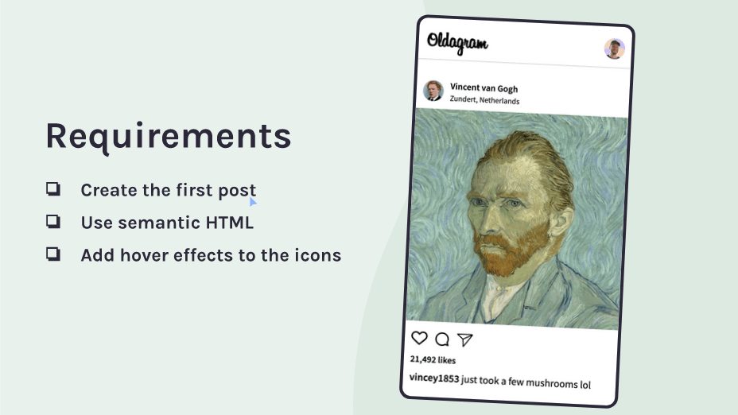

# Oldagram | Scrimba's Essential CSS concepts Solo Project

This is my solution to the Scrimba's Oldagram Solo project from the Essential CSS concepts module of [The Frontend Developer Career Path](https://scrimba.com/learn/frontend/). 

## Table of contents

- [Overview](#overview)
  - [The challenge](#the-challenge)
  - [Screenshot](#screenshot)
  - [Links](#links)
- [My process](#my-process)
  - [Built with](#built-with)
  - [Code I am proud of most](#code-i-am-proud-of-most)
  - [Useful resources](#useful-resources)
- [Author](#author)

## Overview

### The challenge



### Screenshot


### Links

- Solution URL: [GitHub](https://github.com/jumaHarun/oldgram)
- Live Site URL: [Oldagram on Netlify](https://jharun-oldagram.netlify.app/)

## My process

### Built with

- Semantic HTML5 markup
- CSS custom properties
- Flexbox
- Mobile-first workflow
- [Random User Generator](https://reactjs.org/) - API

### Code I am proud of most

```js
fetch('https://randomuser.me/api/')
	.then(res => res.json())
	.then(data => {
  document.getElementById('avatar').innerHTML +=`
  	
  `;
})
```

### Useful resources

- [Random User Generator](https://randomuser.me) - Random user generator is a FREE API for generating placeholder user information. Get profile photos, names, and more. It's like Lorem Ipsum, for people, and I used it to get different profile pictures for all the visitors to my project.

## Author

- LinkedIn - [Juma Harun](https://www.linkedin.com/in/jumaHarun)
- Twitter - [@jumaH4run](https://twitter.com/jumaH4run/)
